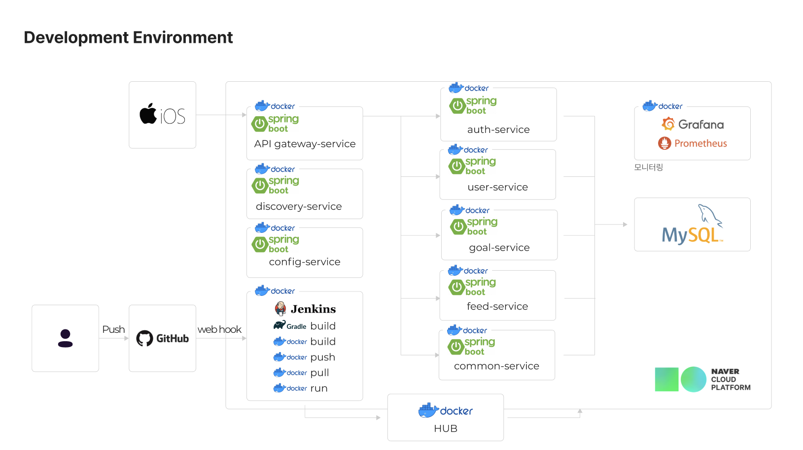

# 갓생살기

## 💻 1. 프로젝트 소개

갓생살기는 꿈을 이룬 갓생러가 꿈을 이루기 위해 노력했던 과정과 투두리스트를 피드를 통해 **공유**하고,  
꿈을 이루려는 사람들은 **그 리스트를 가져와** 실천할 수 있게 도와주는 앱입니다.  
`기획2, 디자인2, 프론트2, 백엔드2` 8명의 인원이 아이템 도출 및 기획부터 개발까지 사이드프로젝트로 진행했습니다.

## 📅 2. 프로젝트 기간
- 2022.08 ~ 2022.12 (12월 중순 출시 예정)

## 🗣 3. 협업 환경
- Git
  - [커밋 컨벤션](./git/%EA%B9%83%EC%BB%A8%EB%B2%A4%EC%85%98.md)
  - [브랜치 전략](./git/%EB%B8%8C%EB%9E%9C%EC%B9%98%EC%A0%84%EB%9E%B5.md)
  - [코드 리뷰](./git/%EC%BD%94%EB%93%9C%EB%A6%AC%EB%B7%B0%ED%94%84%EB%A1%9C%EC%84%B8%EC%8A%A4.md)
- 커뮤니케이션
  - Slack, Notion, Figma 활용

## 🧑‍💻 4. 백엔드 기술 스택
- Java, Gradle, SpringBoot
- JPA, QueryDSL
- MySQL
- Spring Cloud
- Naver Cloud Platform
- Docker
- Jenkins

## 5. 인프라 & CI/CD

- 프로덕션 서비스 인프라
  - discovery-service
    - spring cloud eureka server를 활용하여 구현
    - 각각의 비즈니스 서비스는 discovery client로 server에 등록되어 사용되어짐
  - config-service
    - spring cloud config server를 활용하여 구현
  - apigateway-service
    - spring cloud gateway를 활용하여 구현
    - JWT 서비스토큰의 유효성 검사 및 인증, 인가 역할 담당
    - Filter를 활용하여 각 서비스를 호출

  - auth-service
    - JWT 서비스토큰의 발행, 갱신, refresh token 관리 등의 토큰 생명주기 담당
  - user-service
    - 사용자와 관련된 기능을 담당
  - feed-service
    - 갓생살기 피드와 관련된 기능을 담당
  - goal-service
    - 갓생살기 투두리스트와 관련된 기능을 담당
  - common-service
    - 이용약관, 공통 코드 등의 공통 기능을 담당

- 백엔드 CI/CD
  - 개발자 -> 깃허브 푸시 -> 깃허브 웹훅 -> 젠킨스 API 호출 -> 젠킨스에 등록된 Pipeline 실행 -> 도커 컨테이너로 배포

- DB
  - MySQL

## 6. 담당 업무
### 개발반장 역할
- 기획자, 개발자간 커뮤니케이션
- 프론트, 백엔드 개발자간 커뮤니케이션
- 사용할 기술 스택 정리
- 개발 일정, 업무 관리
### 백엔드 개발자 역할
- Naver Cloud Platform 서버 환경 구축
  - [Docker 설치 정리](./infra/CentOS7_Docker%20%EC%84%A4%EC%B9%98.md)
  - [MySQL 설치 정리](./infra/CentOS7_MySQL%208%EB%B2%84%EC%A0%84%20%EC%84%A4%EC%B9%98.md)
  - [MySQL 세팅 정리](./infra/CentOS7_MySQL%20%EC%84%B8%ED%8C%85.md)
- MSA 환경 구축
  - 초기 discovery, apigateway, config service 기본 세팅
  - MSA 환경 구축을 위해 여러 서버를 활용하는 것 대신 Docker Container를 활용하여 최대한 MSA 환경을 구성했습니다
- CI/CD 환경 구축
  - [CI/CD 구축 정리](./infra/CI%2CCD%EA%B5%AC%EC%B6%95.md)
- 목표 투두 RestfulAPI 설계 및 개발 (goal-service)
- 피드 RestfulAPI 설계 및 개발 (feed-service)